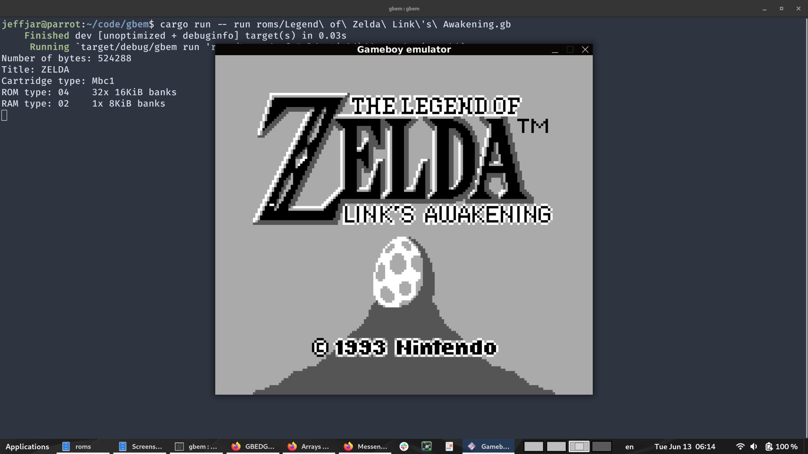
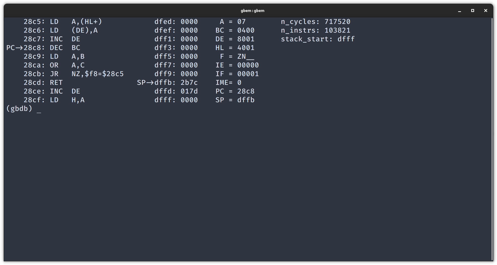

# yagbem
yet another gameboy emulator

## Features
* Written in rust (as a way for me to learn the language!)
* Emulation of all SM83 processor instructions
    * passes the blargg `cpu_instrs` test roms
    * passes the [jsmoo](https://github.com/raddad772/jsmoo/tree/main/misc/tests/GeneratedTests/sm83/v1) instruction tests. These were very helpful for validating basic CPU function! (Place these json files in the `moo-tests` directory and run with a `test-moo` argument)
    * *not* cycle accurate -- the base unit of time is one instruction, which ranges from 4 - 24 "T-cycles", aka 1 - 6 "M-cycles"
* A basic text-based gdb-like debugger for monitoring processor status
* Line-based PPU (pixel-processing unit) rendering
* 4 of 5 interrupts are generated and handled (LCD Vblank, LCD status change, timer overflow, and joypad button press), but again not at a cycle-accurate level
* MBC1 cartridge support

## Peripherals
* Joypad is hooked up to keyboard: `WASD` for direction, `jk` for B/A, and `,.` for select/start
* LCD screen is displayed on the monitor using the SDL2 library
* Audio is not yet implemented (but I want to at some point!) Right now it just plays the same jingle over and over again.
* Serial port output gets printed as ASCII to stderr

## Acknowledgements

Many thanks to the many enthusiasts who have shared information online. In the process of working on this, I totally blown away by the dedication and kindess of this online community. There is so much stuff available! I made extensive use of the resources I could find, and in a few places my implementation derives from what I saw (though I tried my best not to peek too much!)

I am grateful to the following websites in particular:

* Bugzmanov for this [great tutorial](https://bugzmanov.github.io/nes_ebook/chapter_1.html) on writing an NES emulator in Rust; the Rust-specific aspects of emulator programming I owe to you!
* izik1 for this nifty [opcode table!](https://izik1.github.io/gbops/index.html)
* Nintendo devs (?) for the official GameBoy [programming manual (pdf!)](https://ia903208.us.archive.org/9/items/GameBoyProgManVer1.1/GameBoyProgManVer1.1.pdf) with all the opcode and register specifications.
* Gekkio's for the [complete Technical reference (pdf!)](https://gekkio.fi/files/gb-docs/gbctr.pdf)
* all the contributers of the [pandocs](https://gbdev.io/pandocs/)
* Randy Mongenel for [this nice memory map](http://gameboy.mongenel.com/dmg/asmmemmap.html) and [general information](https://fms.komkon.org/GameBoy/Tech/Software.html)

## Caveats

The code is not perfect, but I am not a professional programmer :) It works well enough to run simple games (like Kirby's dreamland and Link to the Past!) and that is enough to make me happy for now. If you want to try to run it yourself, I have only compiled it on my computer (x86 linux) and I have no guarantees that it will compile on yours. You would have to install rust and the SDL2 library.

## Screenshots

 

